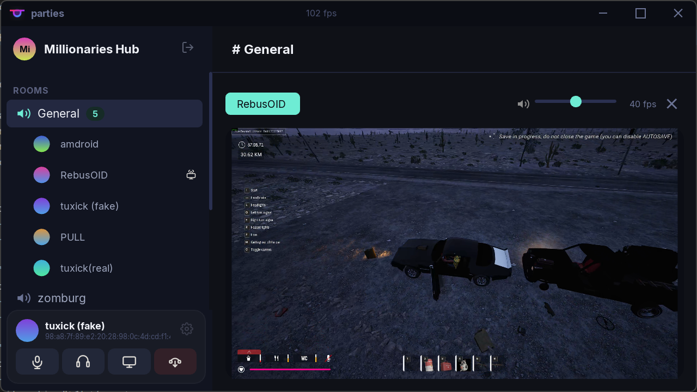

# Parties

Self-hosted voice chat and screen sharing app. No accounts, no tracking — just connect and talk.



## Features

- **Voice chat** with Opus codec, noise cancellation (RNNoise), and echo cancellation
- **Screen sharing** with hardware-accelerated encoding (AV1/H.265/H.264)
- **End-to-end encryption** via QUIC (TLS 1.3)
- **Ed25519 identity** — no passwords, no email, just a seed phrase
- **SFU architecture** — server forwards, never decodes
- **Self-hosted** — run your own server on any machine

## Building

### Prerequisites

- CMake 3.25+
- Clang/LLVM 20+ (clang-cl on Windows)
- vcpkg (manifest mode, auto-bootstrapped)
- Ninja

### Build

```bash
cmake --preset default
cmake --build --preset default
```

### Presets

| Preset | Description |
|--------|-------------|
| `default` | Debug build |
| `release` | Optimized release build |
| `asan` | RelWithDebInfo + AddressSanitizer |

## Architecture

Single QUIC connection on UDP port 7800:

- **Control stream** (stream 0) — bidirectional, length-prefixed messages
- **Video stream** (stream 1) — reliable screen share frames
- **Voice datagrams** — unreliable, unordered Opus packets

See [docs/protocol.md](docs/protocol.md) for the full protocol specification.

## License

This project is licensed under the [MIT License](LICENSE).

### wolfSSL Commercial Notice

Parties uses [wolfSSL](https://www.wolfssl.com/) as its TLS backend, which is dual-licensed under GPLv2 and a commercial license. For **non-commercial and open-source usage**, the GPLv2 license applies and is compatible with this project's MIT license.

For **commercial use**, you must either:

1. **Purchase a wolfSSL commercial license** (~$8,000) from [wolfssl.com](https://www.wolfssl.com/license/) to use wolfSSL in proprietary/closed-source products, or
2. **Replace wolfSSL with OpenSSL** (Apache 2.0 licensed), which has no such restriction for commercial use
