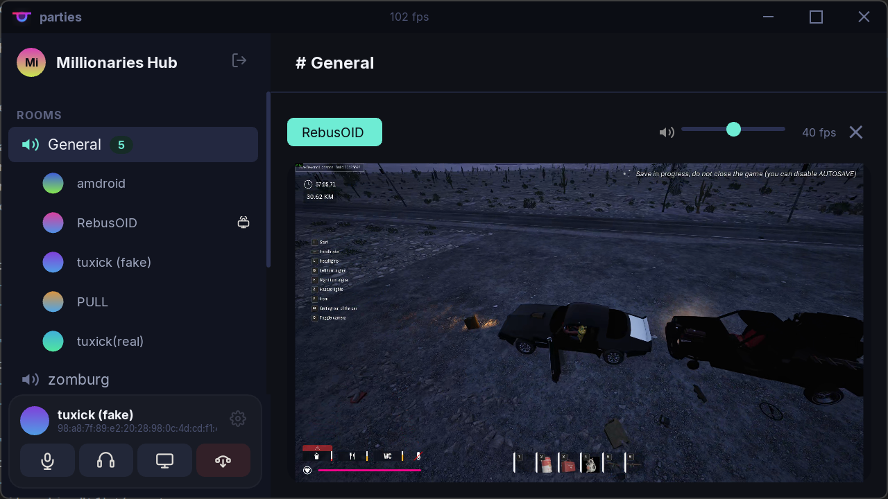

# Parties

Self-hosted voice chat and screen sharing app. No accounts, no tracking — just connect and talk.



## Features

- **Voice chat** with Opus codec, noise cancellation (RNNoise), and echo cancellation
- **Screen sharing** with hardware-accelerated encoding (AV1/H.265/H.264)
- **End-to-end encryption** via QUIC (TLS 1.3)
- **Ed25519 identity** — no passwords, no email, just a seed phrase
- **SFU architecture** — server forwards, never decodes
- **Self-hosted** — run your own server on any machine

## Building

### Prerequisites

- CMake 3.25+
- Clang/LLVM 20+ (clang-cl on Windows)
- vcpkg (manifest mode, auto-bootstrapped)
- Ninja
- macOS/iOS: Xcode, the macOS/iOS SDKs, and `pkg-config`

### Build

```bash
cmake --preset default
cmake --build --preset default
```

### Presets

| Preset | Description |
|--------|-------------|
| `default` | Debug build |
| `release` | Optimized release build |
| `asan` | RelWithDebInfo + AddressSanitizer |
| `macos-arm64-debug` | macOS ARM64 Debug app bundle |
| `macos-arm64-release` | macOS ARM64 Release app bundle |
| `ios-arm64-debug` | iOS device ARM64 Debug app bundle (unsigned without a team ID) |
| `ios-arm64-release` | iOS device ARM64 Release app bundle (unsigned without a team ID) |
| `ios-simulator-arm64-debug` | iOS Simulator ARM64 Debug app bundle |

Apple builds use the same configure/build workflow:

```bash
cmake --preset macos-arm64-debug
cmake --build --preset macos-arm64-debug

cmake --preset ios-arm64-debug
cmake --build --preset ios-arm64-debug
```

For an Apple Silicon iOS Simulator build, use the matching simulator preset:

```sh
cmake --preset ios-simulator-arm64-debug
cmake --build --preset ios-simulator-arm64-debug
```

Pass `-DAPPLE_DEVELOPMENT_TEAM=<TEAM_ID>` while configuring an iOS preset to
enable automatic signing for device installation or archiving. Without a team
ID the generated iOS project remains unsigned, which is suitable for CI compile
checks.

For production iOS screen verification and a signed TestFlight archive:

```sh
tools/capture-ui-ios.sh
tools/archive-ios.sh build/ios/Parties.xcarchive <TEAM_ID>
```

The capture script requires a booted simulator and a Debug simulator build.
The archive script builds Retail Release, packages matching dSYM symbols, and
verifies the signature before the archive is distributed through Xcode or
`xcodebuild -exportArchive`. Set `CMAKE` to an absolute CMake executable path
when it is not on `PATH`. See [designer/README.md](designer/README.md) for the
screen scenarios and interaction checks.

## Architecture

Single QUIC connection on UDP port 7800:

- **Control stream** (stream 0) — bidirectional, length-prefixed messages
- **Video stream** (stream 1) — reliable screen share frames
- **Voice datagrams** — unreliable, unordered Opus packets

See [docs/protocol.md](docs/protocol.md) for the full protocol specification.

## License

This project is licensed under the [MIT License](LICENSE).

See [THIRD_PARTY_LICENSES.md](THIRD_PARTY_LICENSES.md) for a full list of third-party dependencies and their licenses.
