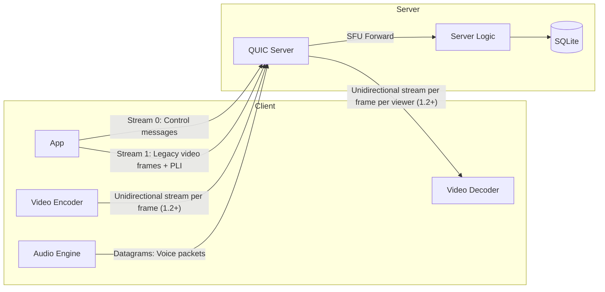
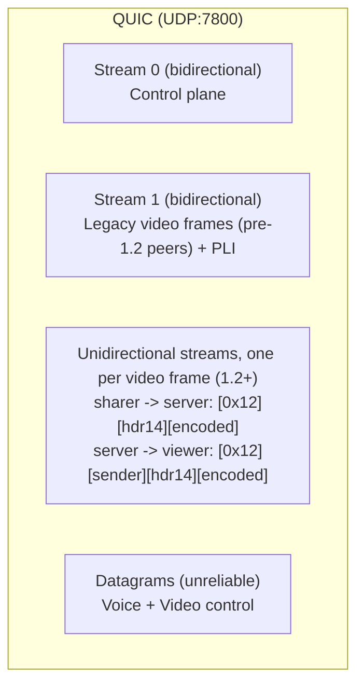
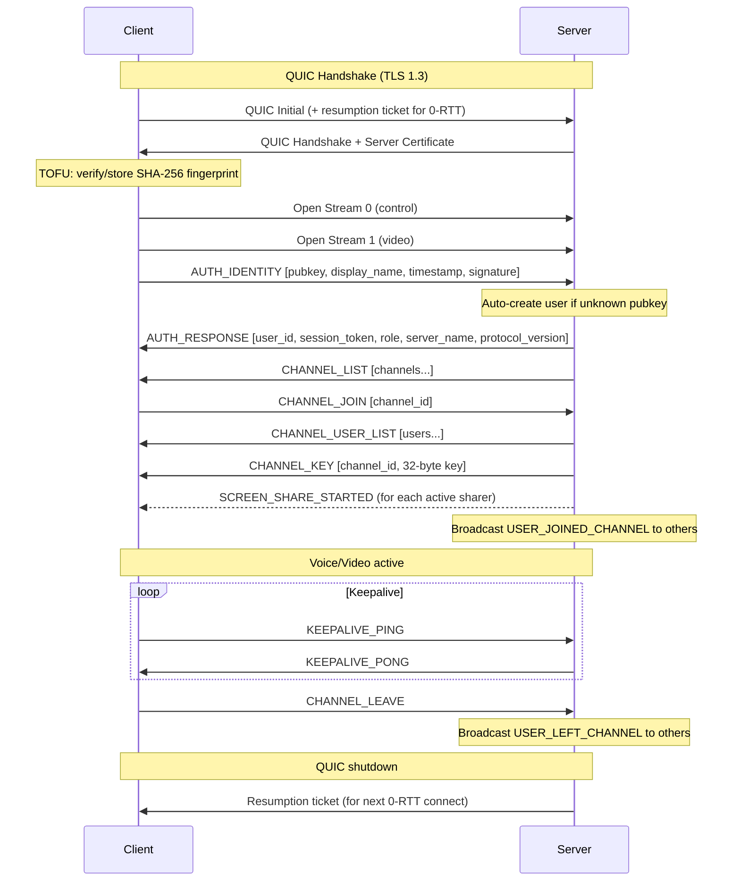
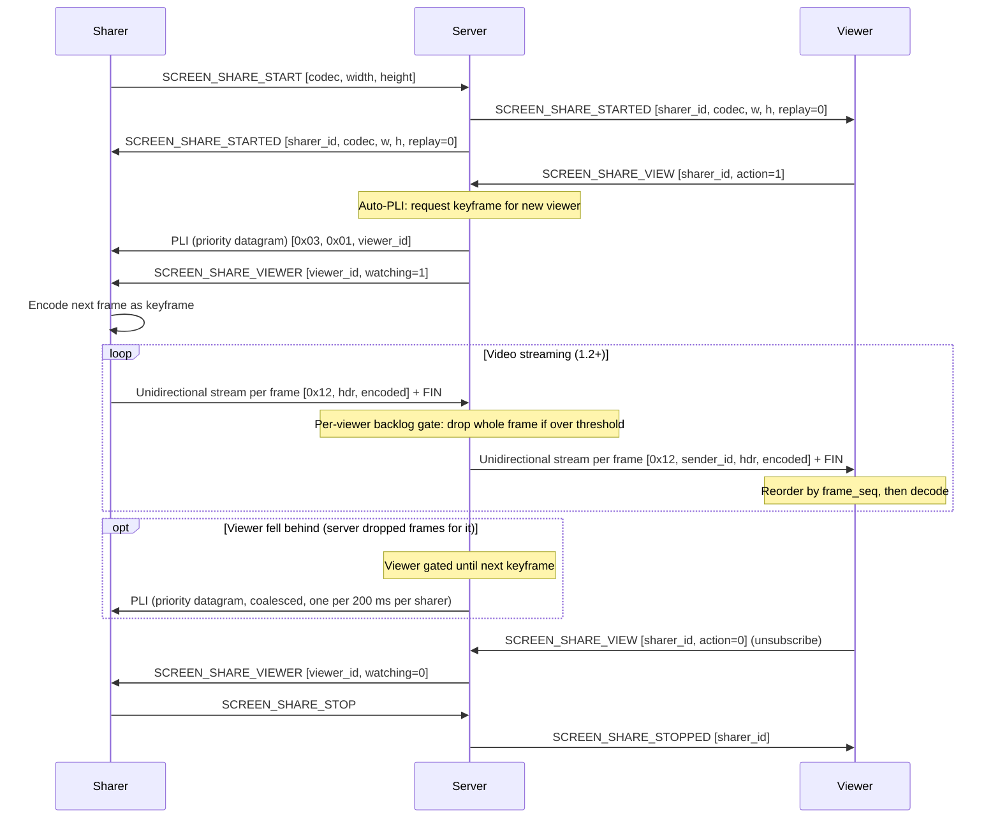
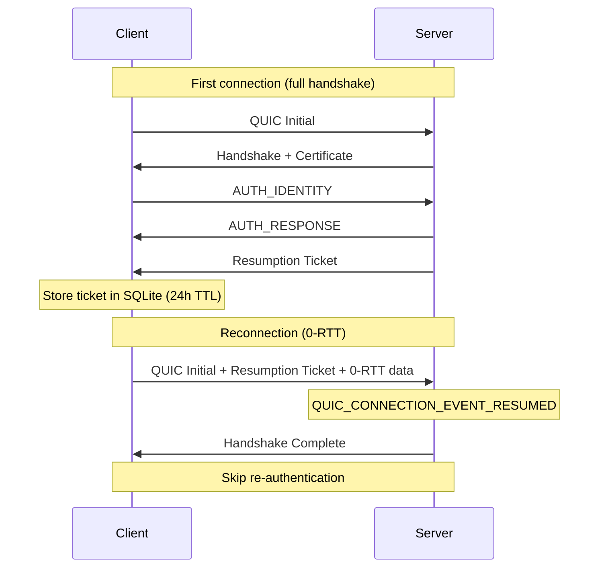

# Parties Networking Protocol

> Version 1.2 -- September 2026

The wire version is a `u16` (major in the high byte, minor in the low byte) sent in
AUTH_IDENTITY and, since 1.2, echoed back in AUTH_RESPONSE. The server rejects only
on a **major** mismatch; every minor bump is additive.

| Version | Date | Changes |
|---------|------|---------|
| 1.0 | March 2026 | Baseline: single QUIC connection, control stream 0, reliable video stream 1, voice datagrams |
| 1.1 | June 2026 | Secondary voice stream VOICE2 (`0x05`), same wire shape as voice |
| 1.2 | September 2026 | Per-frame unidirectional video streams (`0x12`), SCREEN_SHARE_VIEWER (0x010D), trailing `protocol_version` in AUTH_RESPONSE, trailing `replay` flag in SCREEN_SHARE_STARTED, QUIC pacing enabled |

## 1. Overview

Parties is a self-hosted VOIP application with screen sharing. All communication runs over a single **QUIC** connection on **UDP port 7800**.

| Layer | Transport | Purpose |
|-------|-----------|---------|
| Control plane | QUIC bidirectional stream 0 | Auth, channels, admin, screen share signaling |
| Video plane (1.2+) | QUIC unidirectional streams, one per frame | Screen share frames, sharer -> server and server -> viewer; a lost packet delays only its own frame |
| Video plane (legacy) + video control | QUIC bidirectional stream 1 | Screen share frames for pre-1.2 peers (reliable, ordered); viewer -> server PLI keyframe requests |
| Voice plane + sharer-bound control | QUIC datagrams | Opus audio (unreliable, unordered, `DGRAM_PRIORITY`); server -> sharer PLI (priority datagram, never queued behind video) |

- **ALPN**: `parties` (7 bytes)
- **TLS**: 1.3 via wolfSSL (QUIC-aware)
- **Certificates**: Self-signed RSA-4096, verified via TOFU
- **Idle timeout**: 60 seconds (client keepalive every 15s)
- **Session resumption**: 0-RTT via resumption tickets

## 2. Architecture





Per-frame streams are only used toward a peer that reported protocol 1.2 or newer;
the server re-originates whole frames on whichever path each viewer supports, so
1.1 and 1.2 clients can share the same channel.

## 3. Connection Lifecycle



## 4. Message Framing

All control messages on Stream 0 use length-prefixed framing:

```
 0                   1                   2                   3
 0 1 2 3 4 5 6 7 8 9 0 1 2 3 4 5 6 7 8 9 0 1 2 3 4 5 6 7 8 9 0 1
+-+-+-+-+-+-+-+-+-+-+-+-+-+-+-+-+-+-+-+-+-+-+-+-+-+-+-+-+-+-+-+-+
|                        Length (u32 LE)                        |
+-+-+-+-+-+-+-+-+-+-+-+-+-+-+-+-+-+-+-+-+-+-+-+-+-+-+-+-+-+-+-+-+
|        Message Type (u16 LE)  |         Payload...            |
+-+-+-+-+-+-+-+-+-+-+-+-+-+-+-+-+-+-+-+-+-+-+-+-+-+-+-+-+-+-+-+-+
```

- **Length**: Size of message type + payload (not including the 4-byte length field itself)
- **Byte order**: Little-endian for all integers
- **Max message size**: 1,048,576 bytes (1 MB)
- **String encoding**: `[u16 length][UTF-8 bytes]`

## 5. Control Messages Reference

### 5.1 Authentication

#### AUTH_IDENTITY (0x0001) -- C->S

| Field | Type | Size | Description |
|-------|------|------|-------------|
| public_key | bytes | 32 | Ed25519 public key |
| display_name | string | 2+N | User-chosen display name |
| timestamp | u64 | 8 | Unix timestamp (replay protection) |
| signature | bytes | 64 | Ed25519 signature over (public_key + display_name + timestamp) |

Server auto-creates user on first auth with an unknown public key. No separate registration step.

#### AUTH_RESPONSE (0x0101) -- S->C

| Field | Type | Size | Description |
|-------|------|------|-------------|
| user_id | u32 | 4 | Assigned user ID |
| session_token | bytes | 32 | Random session token |
| role | u8 | 1 | User role (see [Roles](#9-permissions--roles)) |
| server_name | string | 2+N | Server display name |
| protocol_version | u16 | 2 (optional, 1.2+) | Protocol version the server speaks, same packing as in AUTH_IDENTITY |

`protocol_version` is a trailing field: 1.2+ servers always append it, older
servers do not, and clients tolerate its absence (an absent field means the
server is assumed to speak 1.1 and only the legacy video stream 1 is used toward
it). Readers must ignore any unknown trailing bytes.

#### SERVER_ERROR (0x01FF) -- S->C

| Field | Type | Description |
|-------|------|-------------|
| message | string | Human-readable error description |

### 5.2 Channels

#### CHANNEL_JOIN (0x0002) -- C->S

| Field | Type | Size | Description |
|-------|------|------|-------------|
| channel_id | u32 | 4 | Channel to join |

#### CHANNEL_LEAVE (0x0003) -- C->S

No payload.

#### CHANNEL_LIST (0x0102) -- S->C

| Field | Type | Description |
|-------|------|-------------|
| count | u32 | Number of channels |
| *per channel:* | | |
| id | u32 | Channel ID |
| name | string | Channel name |
| max_users | u32 | Maximum users (0 = unlimited) |
| sort_order | u32 | Display sort order |
| user_count | u32 | Current number of users |

#### CHANNEL_USER_LIST (0x0103) -- S->C

| Field | Type | Description |
|-------|------|-------------|
| channel_id | u32 | Channel ID |
| count | u32 | Number of users |
| *per user:* | | |
| user_id | u32 | User ID |
| username | string | Display name |
| role | u8 | Role (0-3) |
| muted | u8 | 1 = self-muted |
| deafened | u8 | 1 = self-deafened |

#### USER_JOINED_CHANNEL (0x0104) -- S->C

| Field | Type | Description |
|-------|------|-------------|
| user_id | u32 | User who joined |
| username | string | Their display name |
| channel_id | u32 | Channel they joined |

#### USER_LEFT_CHANNEL (0x0105) -- S->C

| Field | Type | Description |
|-------|------|-------------|
| user_id | u32 | User who left |
| channel_id | u32 | Channel they left |

#### CHANNEL_KEY (0x0109) -- S->C

| Field | Type | Size | Description |
|-------|------|------|-------------|
| channel_id | u32 | 4 | Channel ID |
| key | bytes | 32 | Per-channel encryption key |

Sent immediately after the user joins a channel. The key is generated on first join and cached server-side.

### 5.3 Keepalive

#### KEEPALIVE_PING (0x0004) -- C->S

No payload. Client sends periodically to prevent idle timeout.

#### KEEPALIVE_PONG (0x0107) -- S->C

No payload. Server echoes back immediately.

### 5.4 Screen Sharing Signaling

#### SCREEN_SHARE_START (0x0007) -- C->S

| Field | Type | Size | Description |
|-------|------|------|-------------|
| codec | u8 | 1 | Video codec ID |
| width | u16 | 2 | Capture width in pixels |
| height | u16 | 2 | Capture height in pixels |

#### SCREEN_SHARE_STOP (0x0008) -- C->S

No payload.

#### SCREEN_SHARE_VIEW (0x0009) -- C->S

A viewer may watch **several** sharers at once (the client tiles them in a grid),
so a session holds a *set* of subscriptions. Two wire forms:

| Field | Type | Size | Description |
|-------|------|------|-------------|
| target_user_id | u32 | 4 | Sharer id |
| action | u8 | 1 (optional) | `1` = subscribe, `0` = unsubscribe |

- **Legacy (4 bytes, no `action`):** single-select — replaces the whole set with
  `{target}` (target `0` = clear all). Used by single-decoder clients (macOS/iOS).
- **Additive (5 bytes):** `action=1` adds `target`, `action=0` removes it
  (`target 0, action 0` = clear all). Used by the multi-stream grid (desktop).

Subscribing to a sharer triggers an auto-PLI to that sharer (keyframe for the new
viewer) and, when the sharer speaks 1.2+, a SCREEN_SHARE_VIEWER notification to
the sharer (`watching = 1` on subscribe, `0` on unsubscribe). Subscriptions are
cleared on channel leave, disconnect, and when the sharer stops.

#### SCREEN_SHARE_STARTED (0x010A) -- S->C

| Field | Type | Size | Description |
|-------|------|------|-------------|
| sharer_user_id | u32 | 4 | Who started sharing |
| codec | u8 | 1 | Video codec ID |
| width | u16 | 2 | Capture width |
| height | u16 | 2 | Capture height |
| replay | u8 | 1 (optional, 1.2+) | `1` = late-join replay of an already active share, `0`/absent = live start |

Broadcast to all users in the channel when a share starts (`replay = 0`), and sent
to a joining user once per active sharer (`replay = 1`). The trailing byte lets
the client play a "stream started" notification only for genuine starts by
someone else; older servers omit it and clients treat absence as `0`.

#### SCREEN_SHARE_VIEWER (0x010D) -- S->C

| Field | Type | Size | Description |
|-------|------|------|-------------|
| viewer_id | u32 | 4 | The viewer that changed its subscription |
| watching | u8 | 1 | `1` = subscribed to your stream, `0` = unsubscribed |

Sent **only to the sharer** whose stream is affected, and only when that sharer
reported protocol 1.2+. Never sent for the sharer's own self-preview subscription
(`viewer_id == sharer_id`). Fired on SCREEN_SHARE_VIEW and on the implicit
unsubscribes (channel leave, disconnect). The client uses it for a "viewer
joined" sound and for a viewer count on the sharer's side.

#### SCREEN_SHARE_STOPPED (0x010B) -- S->C

| Field | Type | Size | Description |
|-------|------|------|-------------|
| sharer_user_id | u32 | 4 | Who stopped sharing |

#### SCREEN_SHARE_DENIED (0x010C) -- S->C

| Field | Type | Description |
|-------|------|-------------|
| reason | string | Why the share was denied |

### 5.5 Admin Operations

#### ADMIN_CREATE_CHANNEL (0x0201) -- C->S

| Field | Type | Description |
|-------|------|-------------|
| name | string | Channel name |
| max_users | u32 | Max users (0 = server default) |

Requires `CreateChannel` permission.

#### ADMIN_DELETE_CHANNEL (0x0202) -- C->S

| Field | Type | Size | Description |
|-------|------|------|-------------|
| channel_id | u32 | 4 | Channel to delete |

Requires `DeleteChannel` permission. All users in the channel are kicked first.

#### ADMIN_SET_ROLE (0x0203) -- C->S

| Field | Type | Size | Description |
|-------|------|------|-------------|
| target_user_id | u32 | 4 | User to modify |
| new_role | u8 | 1 | New role (0-3) |

Cannot promote above your own role. Requires `ManageRoles` permission.

#### ADMIN_KICK_USER (0x0204) -- C->S

| Field | Type | Size | Description |
|-------|------|------|-------------|
| target_user_id | u32 | 4 | User to kick |

Requires `KickFromServer` permission.

#### ADMIN_RESULT (0x0301) -- S->C

| Field | Type | Description |
|-------|------|-------------|
| success | u8 | 1 = success, 0 = failure |
| message | string | Result description |

## 6. Voice Data Plane

Voice audio is sent as QUIC datagrams (unreliable, unordered) for minimal latency.

### Packet format

**Client sends:**

```
+------+----------------------------+
| 0x01 |      Opus encoded audio    |
| 1 B  |       variable length      |
+------+----------------------------+
```

**Server forwards (SFU):**

```
+------+-----------+----------------------------+
| 0x01 | sender_id |      Opus encoded audio    |
| 1 B  |   4 B LE  |       variable length      |
+------+-----------+----------------------------+
```

The server **never decodes** voice data. It prepends the sender's user ID and forwards to all authenticated users in the same channel who are not deafened.

### Secondary voice stream (VOICE2, `0x05`)

An **optional** second per-user audio stream sharing the exact wire shape of the
primary voice plane, but with packet type `0x05`. It carries auxiliary audio
(karaoke backing track, channel join sound, plugin audio) that the receiver mixes
**without** the primary stream's makeup gain or normalization, at its own volume.

The SFU forwards `0x05` identically to `0x01` (echoing the type byte). Peers that
do not implement it ignore the unknown type, so it is fully backwards compatible —
a client that never sends `0x05` is indistinguishable from one that can't.

### Opus codec parameters

| Parameter | Value |
|-----------|-------|
| Sample rate | 48,000 Hz |
| Channels | 1 (mono) |
| Frame size | 960 samples (20 ms) |
| RNNoise frame | 480 samples (10 ms, 2 per Opus frame) |
| Default bitrate | 32 kbps |
| Max packet size | 512 bytes |

## 7. Video Data Plane

Since 1.2 every encoded screen-share frame travels on its **own unidirectional
QUIC stream**, so a lost packet delays only that frame instead of every frame
behind it. **QUIC Stream 1** (bidirectional, reliable, ordered) is retained for
peers that did not report 1.2+ and for viewer -> server PLI control packets (the
server relays a PLI to the sharer as a priority datagram, see
[Video control (PLI)](#video-control-pli)).

Both paths carry the same 14-byte frame header.

### Frame header (14 bytes, shared by both paths)

```
+-------+-------+-------+-------+-------+-------+
|  fn   |  ts   | flags | width |height | codec |
| 4B LE | 4B LE |  1 B  | 2B LE | 2B LE |  1 B  |
+-------+-------+-------+-------+-------+-------+
```

| Field | Type | Description |
|-------|------|-------------|
| frame_seq | u32 | Sequential frame counter; stamped by the sharer after encode, reset only at share start and on disconnect. Comparisons are wrap-safe |
| timestamp | u32 | Presentation timestamp (currently mirrors `frame_seq`; nothing consumes it) |
| flags | u8 | Bitfield: bit 0 = keyframe |
| width | u16 | Frame width in pixels |
| height | u16 | Frame height in pixels |
| codec | u8 | Video codec ID |

Defined as `VideoFrameHeader` in `video_common.h`. `VIDEO_FRAME_MAX_BYTES` (4 MB)
caps the largest on-wire record any stream parser accepts (type byte, `sender_id`,
header and encoded data together). Because the server prepends up to 5 bytes
(type + `sender_id`) when it re-originates a frame, the largest `[header][encoded]`
a sharer may send is `VIDEO_FRAME_MAX_PAYLOAD_BYTES` = `VIDEO_FRAME_MAX_BYTES` - 5;
every ingress enforces that value, so a compliant frame can never be rejected
downstream. An oversized frame is rejected and, on a per-frame stream, the stream
is aborted.

### Per-frame unidirectional streams (1.2+)

One stream per frame, written with a single `StreamSend` carrying FIN. The first
byte is the stream type `0x12` (`STREAM_TYPE_VIDEO_FRAME`).

**Sharer -> server:**

```
+------+---------------------+------------+
| 0x12 | frame header (14 B) |  encoded   |
| 1 B  |                     |  variable  |
+------+---------------------+------------+
```

**Server -> viewer** (one stream per frame *per viewer*, `sender_id` inserted after the type byte):

```
+------+-----------+---------------------+------------+
| 0x12 | sender_id | frame header (14 B) |  encoded   |
| 1 B  |   4 B LE  |                     |  variable  |
+------+-----------+---------------------+------------+
```

A receiver aborts and discards any unidirectional stream whose first byte is not
`0x12` or whose total length exceeds `VIDEO_FRAME_MAX_BYTES`. Because per-frame
streams complete independently, the viewer runs a small reorder buffer keyed by
`frame_seq` (holds newer complete frames for up to 150 ms / 8 frames while an
older one is missing and delivers keyframes immediately) before the frames reach
the ordinary in-order decode path.

How the reorder buffer resumes after a gap decides whether a PLI is sent:

| Gap resumed at | Reported as loss | PLI |
|----------------|------------------|-----|
| A keyframe | No | No -- this is exactly how the server resumes a throttled viewer; the decoder simply re-anchors on the keyframe |
| A delta frame (150 ms hold timeout, an aborted stream, or a buffer overflow) | Yes, once | Yes, through the client's PLI funnel |

The server forwards to each viewer on the path that viewer supports: a 1.2+
viewer gets a per-frame stream, a pre-1.2 viewer gets the frame on stream 1. A
pre-1.2 sharer that still sends on stream 1 is served the same way -- the server
re-originates whole frames on either path.

**Ingress protections (server side).** Per-frame streams are accepted only from
authenticated sessions that are currently registered as sharers
(`SCREEN_SHARE_START` accepted and not yet stopped, left, or disconnected;
`Session::video_ingress_allowed`); a unidirectional stream from any other session
is aborted as soon as it is started. At most 16 MB may be buffered across one
session's unfinished per-frame streams (`Session::VIDEO_INGRESS_MAX_BUFFERED_BYTES`);
a stream that would exceed that is aborted. The largest `[header][encoded]` a
sharer may send is `VIDEO_FRAME_MAX_PAYLOAD_BYTES` (`VIDEO_FRAME_MAX_BYTES` - 5,
i.e. 4 MB minus the 5-byte forwarding prefix).

### Legacy frame format on Stream 1 (pre-1.2 peers)

Each frame is length-prefixed on the stream:

```
+------------------+------+---------------------+------------+
| frame_len (u32)  | 0x02 | frame header (14 B) |  encoded   |
|      4 B LE      | 1 B  |                     |  variable  |
+------------------+------+---------------------+------------+
```

| Field | Type | Description |
|-------|------|-------------|
| frame_len | u32 | Length of everything after this field |
| packet_type | u8 | Always `0x02` (VIDEO_FRAME_PACKET_TYPE) |
| frame header | 14 B | As above |
| encoded_data | bytes | Codec-compressed video data |

**Server forwards** with `sender_id` (u32 LE) inserted after the packet type byte:
`[frame_len][0x02][sender_id][frame header][encoded]`.

### Per-viewer backlog rule (server)

The server keeps, per viewer connection, the number of video bytes **outstanding**
toward that viewer: bytes handed to `StreamSend` minus bytes reported in
`SEND_COMPLETE`. Send buffering is disabled, so `SEND_COMPLETE` fires when the
data has been acknowledged and the counter measures queued + in-flight bytes.

| Rule | Value |
|------|-------|
| Threshold | `clamp(viewer_rate x (MinRtt + 250 ms) + keyframe_headroom, 64 KB, 2 MB)` (`video_backlog_threshold_bytes`). `viewer_rate` is the **sum** of the measured send rates of every sharer the viewer is subscribed to (they all share the one outstanding-bytes counter); `MinRtt` is the viewer connection's minimum RTT, sampled from `QUIC_PARAM_CONN_STATISTICS_V2` about once per second and clamped to 1 s (the smoothed RTT already contains the queueing the gate is trying to detect); `keyframe_headroom` is the largest keyframe recently seen from those sharers, so one admitted keyframe cannot by itself trip the gate for the deltas behind it |
| Drop granularity | Whole frames only; a frame is dropped for a viewer when that viewer is over threshold at forward time |
| Resume | After any drop the viewer receives nothing until the next keyframe (`ViewerVideoGate.awaiting_keyframe`) |
| Keyframe request | The server asks the sharer for a keyframe when a gated viewer is waiting, coalesced per sharer to one request per 200 ms |

Dropping is per (viewer, sharer) and never affects other viewers of the same
sharer. Dropping a keyframe is deliberate when the viewer is over threshold:
queueing it would only add delay.

The RTT term is required because the counter also holds bytes that are merely in
flight: with send buffering disabled a send completes only when it is
acknowledged, never before one RTT, so without it a long-RTT viewer would be
throttled even on a lossless link.

### Sharer admission and bitrate adaptation

The sharer keeps the same outstanding-bytes counter toward the server
(`VideoSendController`) and applies two coupled controls:

| Control | Rule |
|---------|------|
| Admission | A capture frame is encoded only when the outstanding bytes imply no more than ~120 ms of queueing beyond the RTT at the current bitrate; otherwise the capture frame is skipped (no keyframe needed because `frame_seq` is stamped after encode) |
| Decrease (x0.8) | A 500 ms window is congested when its peak queueing delay is >= 80 ms, actual (spurious-corrected) packet loss exceeds 3 %, or any admission, encoder, or send drop occurred in it; after two consecutive congested windows the bitrate is multiplied by 0.8 (not below the 800 kbps floor). A clean window resets the count |
| Increase (x1.08) | After 2 s (four consecutive 500 ms windows) without congestion, loss, or drops, up to the user's target bitrate |
| Floor | 800 kbps (`VIDEO_ADAPT_MIN_BITRATE`); below this the sender drops frames instead of lowering quality further |
| Reconfigure rate | Encoder bitrate changes at most every 500 ms and only when they differ by >= 10 %; the final step onto the user's target (or onto the floor) is always published to the encoder even when it is smaller than the 10 % delta gate |

RTT and loss come from `QUIC_PARAM_CONN_STATISTICS_V2` once per UI tick. A send
call that fails synchronously counts the frame as lost and forces the next
encoded frame to be a keyframe.

### Video codec IDs

| ID | Codec | Notes |
|----|-------|-------|
| 0x01 | AV1 | Preferred, decoded with dav1d |
| 0x02 | H.265 | Fallback |
| 0x03 | H.264 | Last resort |

### Bitrate limits

| Parameter | Value |
|-----------|-------|
| Maximum bitrate | 20 Mbps |
| Default bitrate | 2 Mbps |
| Minimum bitrate (UI floor) | 200 kbps |
| Adaptation floor | 800 kbps |
| Max keyframe interval | 5 seconds |
| PLI cooldown | 500 ms minimum between sends per target |

### Video control (PLI)

Video control packets share the `0x03` type byte. The two hops of a PLI use
different transports:

- **Viewer -> server**: on **stream 1**, length-prefixed like a frame
  (`[u32 len][0x03][0x01][target_user_id]`), so the request itself is never lost.
- **Server -> sharer**: forwarded viewer PLIs, the subscribe auto-PLI and the
  backlog-recovery PLI are all sent as a **priority QUIC datagram**
  (`DGRAM_PRIORITY`) with the same 6-byte body, so a keyframe request is never
  queued behind video. Delivery is best effort: a lost PLI is covered by the
  viewer's 500 ms PLI retry while a keyframe is pending and by the sharer's 5 s
  maximum keyframe interval.

Both forms are accepted on receive. The body is:

```
+------+---------+-------------------+
| 0x03 | subtype |    payload        |
| 1 B  |   1 B   |    variable       |
+------+---------+-------------------+
```

| Subtype | ID | Payload | Description |
|---------|----|---------|-------------|
| PLI | 0x01 | target_user_id (u32) | Request keyframe from sharer |
| SHARE_START | 0x02 | -- | (reserved, unused) |
| SHARE_STOP | 0x03 | -- | (reserved, unused) |
| NACK | 0x04 | -- | (reserved for a possible datagram video path; not implemented, do not reuse) |
| RECEIVER_REPORT | 0x05 | -- | (reserved, same as above) |

PLI rate limits:

| Where | Rule |
|-------|------|
| Client (sender of PLI) | One funnel with a 500 ms cooldown per target; while a watched stream is still waiting for a keyframe the PLI is retried every 500 ms. Escalation cap: after two consecutive stale-backlog flushes without a keyframe the viewer stops sending PLIs for that stream (logs "decoder too slow") and waits for the sharer's periodic keyframe. The self-preview stream never sends PLIs |
| Client (receiver of PLI, sharer) | Incoming PLIs force a keyframe through a 500 ms cooldown |
| Server | Per-session token bucket of 4 PLIs/s with a burst of 4, checked before any work; PLIs from a viewer that is currently over its backlog threshold are not forwarded (the viewer would drop the keyframe anyway); forwarded PLIs are coalesced per sharer |

## 8. Screen Sharing Protocol



Key properties:
- **Multiple sharers per channel**: Each viewer picks which sharer(s) to watch
- **Subscription-based delivery**: Video only flows to viewers who explicitly subscribe
- **Auto-PLI on subscribe**: Server sends immediate PLI so new viewers get a keyframe
- **PLI relay**: Viewer PLIs reach the server on stream 1; every server -> sharer PLI is a priority datagram, never queued behind video
- **Viewer notifications**: The sharer receives SCREEN_SHARE_VIEWER for every subscribe/unsubscribe by another user
- **Per-frame streams**: One unidirectional QUIC stream per frame on each hop (1.2+), so packet loss never stalls later frames
- **Per-viewer backpressure**: A slow viewer only loses its own frames; the sharer and other viewers are unaffected
- **Late-join notifications**: When joining a channel, server sends SCREEN_SHARE_STARTED with `replay = 1` for each active sharer

## 9. Permissions & Roles

### Role hierarchy

| Role | Value | Description |
|------|-------|-------------|
| Owner | 0 | Full control, all permissions |
| Admin | 1 | Manage channels, roles, kick users |
| Moderator | 2 | Mute/deafen others, kick from channel |
| User | 3 | Join channels and speak |

Higher-privilege roles can moderate lower ones but not equal or above. Owners cannot be moderated.

### Permission bitfield (u32)

| Bit | Permission | Owner | Admin | Mod | User |
|-----|------------|:-----:|:-----:|:---:|:----:|
| 0 | JoinChannel | x | x | x | x |
| 1 | Speak | x | x | x | x |
| 2 | MuteOthers | x | x | x | |
| 3 | DeafenOthers | x | x | x | |
| 4 | KickFromChannel | x | x | x | |
| 5 | KickFromServer | x | x | | |
| 6 | CreateChannel | x | x | | |
| 7 | DeleteChannel | x | x | | |
| 8 | ManagePermissions | x | x | | |
| 9 | ManageRoles | x | x | | |
| 10 | ManageServer | x | x | | |
| 11 | SendText | x | | | |
| 12 | UploadFiles | x | | | |
| 13 | ShareScreen | x | | | |
| 14 | ShareWebcam | x | | | |

Default permission masks:

| Role | Hex | Bits |
|------|-----|------|
| Owner | `0xFFFFFFFF` | All |
| Admin | `0x000007FF` | 0-10 |
| Moderator | `0x0000001F` | 0-4 |
| User | `0x00000003` | 0-1 |

## 10. Security Model

### Transport encryption

All data is encrypted by QUIC's built-in TLS 1.3 layer (wolfSSL with QUIC support).

### Server certificates

- **Algorithm**: RSA-4096 with SHA-256
- **Type**: Self-signed, auto-generated on first server run
- **Storage**: PEM files (`server.pem`, `server.key.pem`)
- **Validation**: Trust On First Use (TOFU)
  - Client computes SHA-256 fingerprint of server's DER certificate
  - First connection: silently stored in client's SQLite database
  - Subsequent connections: compared against stored fingerprint
  - Mismatch: connection aborted (possible MITM)

### Identity authentication

Users authenticate via Ed25519 keypairs derived from a 12-word BIP-39 seed phrase. The public key serves as the user's permanent identity. No passwords are used — authentication is signature-based.

| Parameter | Value |
|-----------|-------|
| Algorithm | Ed25519 |
| Key derivation | SHA-256(seed phrase) → 32-byte Ed25519 seed |
| Public key | 32 bytes |
| Signature | 64 bytes |
| Replay protection | Timestamp within ±60s of server time |

### Channel key

A per-channel 32-byte symmetric key is distributed via the CHANNEL_KEY control message. The key is generated on first join and cached server-side. Currently used for channel membership verification; voice and video are protected by QUIC's TLS 1.3 transport encryption.

## 11. Session Resumption & 0-RTT



- **Ticket storage**: SQLite `resumption_tickets` table, keyed by `(host, port)`
- **TTL**: 24 hours (expired tickets are not loaded)
- **Security**: Tickets are deleted on TOFU fingerprint mismatch
- **Server config**: `ServerResumptionLevel = RESUME_AND_ZERORTT`

## 12. Constants & Configuration

### Network

| Constant | Value | Source |
|----------|-------|--------|
| Default port | 7800 | `protocol.h` |
| ALPN | `"parties"` | `quic_common.h` |
| Idle timeout | 60,000 ms | QUIC settings |
| Keepalive interval | 15,000 ms | Client QUIC settings |
| Peer bidirectional streams (`PeerBidiStreamCount`) | 10 on the server (control stream 0 + legacy video stream 1 + up to 8 concurrent file upload/download streams); the client leaves its own count at 0 and aborts any server-opened bidirectional stream | QUIC settings |
| Peer unidirectional streams (`PeerUnidiStreamCount`) | 128 | QUIC settings, both ends |
| Unidirectional stream receive window (`StreamRecvWindowUnidiDefault`) | 4 MB | QUIC settings, both ends (default 64 KB would window-limit keyframes) |
| Pacing (`PacingEnabled`) | on | QUIC settings, both ends |
| Send buffering (`SendBufferingEnabled`) | off | QUIC settings; `SEND_COMPLETE` fires on acknowledgement |
| Max control message | 1,048,576 bytes | `net_client.cpp` |
| Max on-wire video record (`VIDEO_FRAME_MAX_BYTES`) | 4 MB | `video_common.h` |
| Max sharer frame payload (`VIDEO_FRAME_MAX_PAYLOAD_BYTES`) | 4 MB - 5 B (`[header][encoded]`, leaves room for the forwarding prefix) | `video_common.h` |
| Per-session per-frame ingress buffer (`VIDEO_INGRESS_MAX_BUFFERED_BYTES`) | 16 MB across unfinished per-frame streams | `session.h` |
| Per-viewer backlog threshold clamp | 64 KB .. 2 MB | `video_backlog.h` |

### Types

| Type | Definition | Size |
|------|-----------|------|
| UserId | `uint32_t` | 4 bytes |
| ChannelId | `uint32_t` | 4 bytes |
| SessionToken | `array<uint8_t, 32>` | 32 bytes |
| ChannelKey | `array<uint8_t, 32>` | 32 bytes |

### Data plane packet types

| Type | Value | Transport |
|------|-------|-----------|
| Voice | `0x01` | Datagram |
| Video frame (legacy, pre-1.2 peers) | `0x02` | Stream 1 |
| Video frame (per-frame stream, 1.2+) | `0x12` stream type | One unidirectional stream per frame |
| Video control (PLI) | `0x03` | Client -> server: stream 1; server -> sharer: priority datagram; both forms accepted on receive |
| Stream (screen-share) audio | `0x04` | Datagram |
| Secondary voice (VOICE2) | `0x05` | Datagram |

### SFU forwarding model

The server operates as a **Selective Forwarding Unit** (SFU):

- Voice packets (`0x01`) and secondary voice (`0x05`) are forwarded to all authenticated users in the same channel (excluding sender and deafened users)
- Video frames are forwarded to every viewer subscribed to that sharer (a viewer may subscribe to multiple sharers at once), on the path that viewer supports (per-frame stream for 1.2+, stream 1 otherwise)
- Video forwarding is gated per viewer: when the bytes outstanding toward a viewer exceed `clamp(viewer_rate x (MinRtt + 250 ms) + keyframe_headroom, 64 KB, 2 MB)` (`viewer_rate` = sum of the rates of every sharer that viewer watches, `MinRtt` sampled about once per second) the frame is dropped for that viewer as a whole (never partially), the viewer is held until the next keyframe, and the server asks the sharer for one (coalesced to one request per sharer per 200 ms). Other viewers of the same sharer are unaffected
- Per-frame ingress is guarded: streams are accepted only from sessions registered as sharers, at most 16 MB may be buffered per session across unfinished per-frame streams, and a sharer's `[header][encoded]` may not exceed `VIDEO_FRAME_MAX_PAYLOAD_BYTES`
- The server **never decodes** audio or video -- it only prepends the sender's user ID and routes packets
